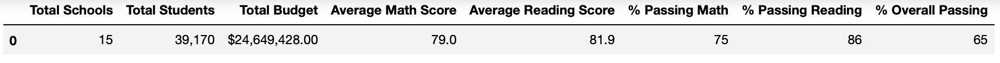
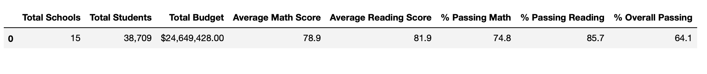
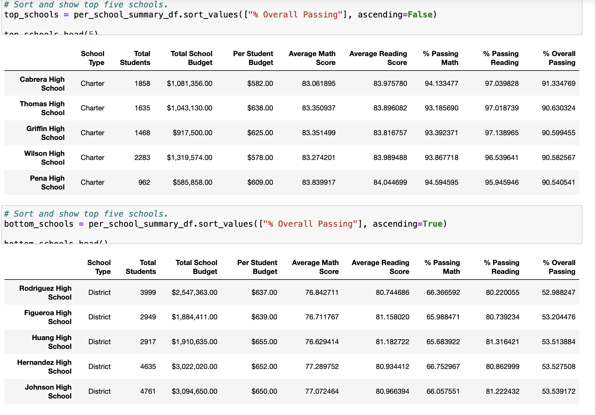

# School_district_analysis
# (Python Anaconda practice on school districts)

## Overview

This assignment is a revised look at the same dataset that was used for the module. The school board has discovered academic dishonesty with the math and reading scores of ninth graders at the Thomas High School (THS), after which our supervisor Maria has asked us to nullify those grades and basically rerun the code and analyze the results. The purpose, then, is to understand how removing the data for math and reading scores of the THS ninth graders affects our initial results.

## Results

### Changes on the District Summary

The removal of the THS ninth graders' scores is reflected on a variety of items in the District Summary. The total number of students naturally declined, and this cause most other indices to decrease albeit slightly. See the below images for the district summary before and after the removal of THS ninth grade scores.

### Changes as seen on the School Summary
Although we canceled the scores of ninth graders at THS, the assignment required us to change only the percentages of 10th to 12th graders at THS. Because of this, on our district summary, only three items changed, namely, the percentages of students passing math, reading, and both math and reading. There was a significant increase in all three metrics after the ninth graders' data was excluded. The below images show the data before and after the removal of the ninth grader score data respectively.

### Changes in the list of top schools

In the list of top and bottom five schools, we can see that THS still remains the second highest, despite insignificant drop in some indices.

### Scores by grade

Needless to say, in comparisons per grade, THS does not show any value for the ninth graders. The other grades' scores remain the same naturally.

### Scores by spending

In the comparison of scores by spending, THS grade-related scores are only minimally impacted. Because our code still counts the ninth graders when analyzing spending per capita, financial metrics remain the same and the THS is still in the same $630-644 bracket.

### Scores by school size

The same can be said as to the comparison by size. Because in this excercise we did not remove the ninth graders from the whole count, financial and demographic indices have not changed. THS is still considered a medium size school (1000 to 2000 students.) The overall impact of our exclusion of the ninth graders in this analysis is negligible.

### Scores by school type

As with the above assessments, the scores by school type analysis also reveals no noticable difference. Any difference we can find is less than 1 in 1000, which basically evaporates as we format numbers to show one decimal place in percentages.

## Challenges and issues remaining

This assignment was mostly pretty straightforward. I was able to use the `loc()` method effectively with the help of online sources. This allowed me to easily set new values for Thomas High School ninth graders in the `per_school_summar_df` dataframe.

More importantly was the need to exclude the same ninth graders from the `ninth_graders` series we created to analyze math and reading scores in the district by grade. This was particularly necessary because earlier we replaced those grades with `NaN`s, which, then, caused an error message when we tried to format the outcome using the `map()` method. I was able to avoid this error by adding the following condition to the series `ninth_graders`: `(school_data_complete_df["school_name"] != "Thomas High School")`.

One issue I did not have the time to fix was with the averages for math and reading in the dataframe `per_school_summar_df`. Because the `mean()` method automatically calculated the average based on all the students (including those ninth graders whose math and reading grades we canceled out), I was not able to reflect the change on the averages.

## Summary

This analysis shows that our removal of math and reading scores of THS ninth grade students (461 people) out of the whole student body of the school district (39169) has hardly any effect on the comparisons our code performed. The most noticable difference was on THS's scores, rather than on district-wide metrics or on THS's ranking among other schools. After the ninth graders were excluded from the dataset, THS's math and reading passing percentages, as well as the percentage of those passing both, increased markedly. 
